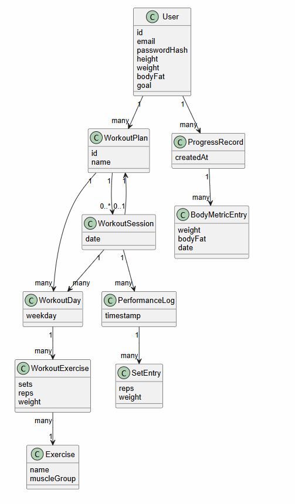
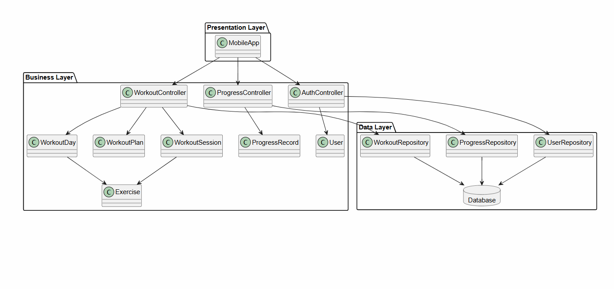
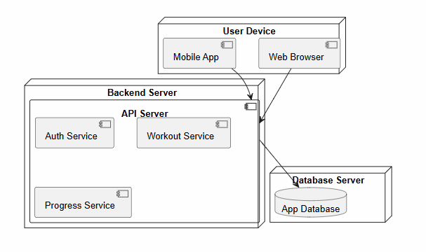

# W8 Development Report

Welcome to the documentation of W8!

This Software Development Report, tailored for LEIC-ES-2025-26, provides comprehensive details about W8, starting from an high-level vision and going into low-level implementation decisions. 

It is organised by the following activities: 

* [Business modeling](#Business-Modelling) 
  * [Product Vision](#Product-Vision)
  * [Features and Assumptions](#Features-and-Assumptions)
* [Requirements](#Requirements)
  * [User stories](#User-stories)
  * [Domain model](#Domain-model)
  * [User interfaces](#User-interfaces)
* [Architecture and Design](#Architecture-And-Design)
  * [Logical architecture](#Logical-Architecture)
  * [Physical architecture](#Physical-Architecture)
  * [Functional prototype](#Functional-Prototype)
* [Project management](#Project-Management)
  * [Sprint 0](#Sprint-0)
  * [Sprint 1](#Sprint-1)
  * [Sprint 2](#Sprint-2)
  * [Sprint 3](#Sprint-3)
  * [Final Release](#Final-Release)

Contributions are expected to be made exclusively by the initial team, but we may open them to the community, after the course, in all areas and topics: requirements, technologies, development, experimentation, testing, etc.

Please contact us!

Thank you!

* Pedro Postiga | up202404966@up.pt
* Pedro Vilaça | up202404967@up.pt
* Filipe Cruz | up202404158@up.pt
* Afonso Maçarico | up202403501@up.pt
* Mateus Francisco | up202403505@up.pt

---
## Business Modelling

Our app, W8, seeks to make training progress much easier, helping people focus only on the workout, without spending a long time tracking
weight, sets and reps, times, distances, etc…

W8 is aimed at any kind of athlete, whether you are a beginner or an experienced athlete, with W8 you can simply log information about your
workouts, and, overtime, track your progress simple and easy.

### Product Vision

<!-- 
Start by defining a clear and concise product vision for your app, to help members of the team, contributors, and users into focusing their often disparate views into a concise, visual, and short textual form. 

The vision should provide a "high concept" of the product for marketers, developers, and managers.

A product vision describes the essential of the product and sets the direction to where a product is headed, and what the product will deliver in the future. 

**We favor a catchy and concise statement, ideally one sentence.**

We suggest you use the product vision template described in the following link:
* [How To Create A Convincing Product Vision To Guide Your Team, by uxstudioteam.com](https://uxstudioteam.com/ux-blog/product-vision/)

To learn more about how to write a good product vision, please read:
* [Vision, by scrumbook.org](http://scrumbook.org/value-stream/vision.html)
* [Product Management: Product Vision, by ProductPlan](https://www.productplan.com/glossary/product-vision/)
* [20 Inspiring Vision Statement Examples (2019 Updated), by lifehack.org](https://www.lifehack.org/articles/work/20-sample-vision-statement-for-the-new-startup.html)
-->

For fitness enthusiasts and begginners who want structured training, W8 helps you schedule your different workouts throughout the week,
whether its weights, cardio, endurance training, etc… You can simply enter the app, add a new workout to your schedule, name it, add the
exercises, sets, reps, and simply start tracking your progress.

### Features and Assumptions
<!-- 
Indicate an  initial/tentative list of high-level features - high-level capabilities or desired services of the system that are necessary to deliver benefits to the users.
 - Feature XPTO - a few words to briefly describe the feature
 - Feature ABCD - ...
...

Optionally, indicate an initial/tentative list of assumptions that you are doing about the app and dependencies of the app to other systems.
-->

  • Height, weight, body composition and goal setting.

  • Suggests type of workouts based on your goals (build muscle, lose weight, endurance, etc…).

  • You can change your body composition and your weight over time, to see how far you’ve come.

  • Premade workouts for people who don’t want to make their own.

  • You can structure your own workouts by naming them and adding the exercises you want.

  • Includes a vast library of all kinds of exercises you can think of.

  • Each time you train, log into the app and update the weight, reps, time, distance, that you have done in the workout.

  • Keeps a log of your progress since you created your account.

  • User authentication for different devices.

## Requirements

### User Stories
<!-- 
In this section you should describe all kinds of requirements for your module: functional and non-functional requirements.

For LEIC-ES-2025-26, the requirements will be gathered and documented as user stories. 

Please add in this section a concise summary of all the user stories (not each user story!).

**User stories as GitHub Project Items**
The user stories themselves should be created and described as items in your GitHub Project with the label "user story". 

A user story is a description of a desired functionality told from the perspective of the user or customer. A starting template for the description of a user story is *As a < user role >, I want < goal > so that < reason >.*

Name the item with either the full user story or a shorter name (recommended). In the “comments” field, add relevant notes, mockup images, and acceptance test scenarios, linking to the acceptance tests when available, and finally estimate value and effort.

**INVEST in good user stories**. 
You may add more details after, but the shorter and complete, the better. In order to decide if the user story is good, please follow the [INVEST guidelines](https://xp123.com/articles/invest-in-good-stories-and-smart-tasks/).

**User interface mockups**.
After the user story text, you should add a draft of the corresponding user interfaces, a simple mockup or draft, if applicable.

**Acceptance tests**.
For each user story you should write also the acceptance tests (textually in [Gherkin](https://cucumber.io/docs/gherkin/reference/)), i.e., a description of scenarios (situations) that will help to confirm that the system satisfies the requirements addressed by the user story.

**Value and effort**.
At the end, it is good to add a rough indication of the value of the user story to the customers (e.g. [MoSCoW](https://en.wikipedia.org/wiki/MoSCoW_method) method) and the team should add an estimation of the effort to implement it using points in a kind-of-a Fibonnacci scale (1,2,3,5,8,13,20,40, no idea).

-->
The app's requirements were gathered and documented as user stories in the
GitHub Project, each labelled `user story`. Below is a concise summary of
the main stories identified for this product.

**Workout logging**

Users can start a workout session, add exercises from the built-in library,
and record sets with weight and reps. This is the core interaction the entire
app is built around.

**Exercise library**

Users can browse a library of exercises filtered by muscle group or equipment,
and select from it when building a workout.

**Workout history**

Users can view a log of all past workout sessions and see what exercises,
sets, and weights were performed in each one.

**Progress tracking**

Users can see charts of their strength evolution over time for any exercise,
including estimated 1RM and total volume per session.

**Personal records**

Users are notified when they beat a personal record during a workout session.

**Rest timer**

Users can use a configurable rest timer between sets that alerts them when
rest time is up.

**Workout templates**

Users can save a workout as a template and reuse it in future sessions without
rebuilding it from scratch.

### Domain model

<!-- 
To better understand the context of the software system, it is useful to have a simple UML class diagram with all and only the key concepts (names, attributes) and relationships involved of the problem domain addressed by your app. 
Also provide a short textual description of each concept (domain class). 

-->

#### Domain Class Descriptions
**User**

Represents an individual using the application.
Stores authentication data and basic physical attributes, along with a high-level fitness goal.
Acts as the root entity that owns workout plans and progress records.

**WorkoutPlan**

Defines a structured training plan created by the user.
Organizes workouts into predefined days (WorkoutDay) and can optionally group multiple workout sessions.

**WorkoutSession**

Represents a concrete workout performed (or scheduled) on a specific date.
Can exist independently or be associated with a WorkoutPlan.
Serves as the main unit for tracking actual workout execution and performance.

**WorkoutDay**

Represents a training day within a weekly structure (e.g., Monday, Push Day).
Used both in planning (inside WorkoutPlan) and execution context (inside WorkoutSession).
Contains the list of exercises to be performed.

**Exercise**

Represents a predefined exercise (e.g., Bench Press, Squat).
Defines general attributes such as name and target muscle group.
Acts as a reference entity reused across workouts.

**WorkoutExercise**

Represents the inclusion of a specific exercise within a workout day.
Stores execution parameters such as sets, repetitions, and weight.
Acts as a bridge between WorkoutDay and Exercise.

**PerformanceLog**

Captures performance data recorded during a workout session at a specific moment.
Groups detailed set-level data for a given exercise or session segment.

**SetEntry**

Represents a single set performed during an exercise.
Stores granular data such as repetitions and weight used.
Provides the lowest-level detail for performance tracking.

**ProgressRecord**

Represents a collection of user progress data over time.
Acts as a container for body-related measurements and historical tracking.

**BodyMetricEntry**

Represents a snapshot of the user’s physical metrics at a given date.
Includes attributes such as weight and body fat percentage.
Used to monitor long-term progress.

## Architecture and Design
<!--
The architecture of a software system encompasses the set of key decisions about its organization. 

A well written architecture document is brief and reduces the amount of time it takes new programmers to a project to understand the code to feel able to make modifications and enhancements.

To document the architecture requires describing the decomposition of the system in their parts (high-level components) and the key behaviors and collaborations between them. 

In this section you should start by briefly describing the components of the project and their interrelations. You should describe how you solved typical problems you may have encountered, pointing to well-known architectural and design patterns, if applicable.~
-->

### Logical architecture
<!--
The purpose of this subsection is to document the high-level logical structure of the code (Logical View), using a UML diagram with logical packages, without the worry of allocating to components, processes or machines.

It can be beneficial to present the system in a horizontal decomposition, defining layers and implementation concepts, such as the user interface, business logic and concepts.

Example of _UML package diagram_ showing a _logical view_ of the Eletronic Ticketing System (to be accompanied by a short description of each package):

-->

### Physical architecture
<!--
The goal of this subsection is to document the high-level physical structure of the software system (machines, connections, software components installed, and their dependencies) using UML deployment diagrams (Deployment View) or component diagrams (Implementation View), separate or integrated, showing the physical structure of the system.

It should describe also the technologies considered and justify the selections made. Examples of technologies relevant for ESOF are, for example, frameworks for mobile applications (such as Flutter).

Example of _UML deployment diagram_ showing a _deployment view_ of the Eletronic Ticketing System (please notice that, instead of software components, one should represent their physical/executable manifestations for deployment, called artifacts in UML; the diagram should be accompanied by a short description of each node and artifact):

-->

### Functional prototype
<!--
To help on validating all the architectural, design and technological decisions made, we usually implement a functional prototype, a thin vertical slice of the system integrating as much technologies as we can.

In this subsection please describe which feature, or part of it, you have implemented, and how, together with a snapshot of the user interface, if applicable.

At this phase, instead of a complete user story, you can simply implement a small part of a feature that demonstrates thay you can use the technology, for example, show a screen with the app credits (name and authors).
-->

#### v0 — Prototype

The prototype implements **live workout logging** — the most characteristic 
and central interaction of the app. The user browses a built-in exercise 
library, adds exercises to an active workout session, and records multiple 
sets per exercise with weight and reps.

This feature was chosen because it represents the unique core loop of a 
workout tracking app: everything else (history, progress charts, templates) 
is built on top of this interaction. No generic app shares this as its 
primary flow.

**What works in this prototype:**
- Browse a built-in exercise library and add exercises to the session
- Add and remove sets per exercise
- Enter weight and reps for each set
- Remove exercises from the active workout

**Known limitations:**
- Workout cannot be saved yet — data is lost when the app is closed
- Exercise library is limited — custom exercises cannot be created yet
- Single screen only — no navigation to other views

## Project management
<!--
Software project management is the art and science of planning and leading software projects, in which they are planned, implemented, monitored and controlled.

In the context of ESOF, we recommend each team to adopt a set of project management practices and tools capable of registering tasks, assigning tasks to team members, adding estimations to tasks, monitor tasks progress, and therefore being able to track their projects.

Common practices of managing agile software development with Scrum are: backlog management, release management, estimation, Sprint planning, Sprint development, acceptance tests, and Sprint retrospectives.

You can find below information and references related with the project management: 

* Backlog management: Product backlog and Sprint backlog in a [Github Projects board](https://github.com/orgs/FEUP-LEIC-ES-2023-24/projects/64);
* Release management: [v0](#), v1, v2, v3, ...;
* Sprint planning and retrospectives: 
  * plans: screenshots of Github Projects board at begin and end of each Sprint;
  * retrospectives: meeting notes in a document in the repository, addressing the following questions:
    * Did well: things we did well and should continue;
    * Do differently: things we should do differently and how;
    * Puzzles: things we don’t know yet if they are right or wrong;
    * list of a few improvements to implement next Sprint;

-->

### Sprint 0

#### Retrospective

**Did well**
- User stories follow the INVEST criteria
- All team members contributed to the Product Backlog
-

**Do differently**
- Start the prototype earlier in the Sprint
- Set internal deadlines earlier that the actual deadline

**Puzzles**
- Unsure if our  backlog has enough items for the rest of the Sprints

**Improvements for Sprint 1**
- Write acceptance tests before implementing each feature
- Refine  and order the backlog

### Sprint 1

### Sprint 2

### Sprint 3

### Sprint 4

### Final Release